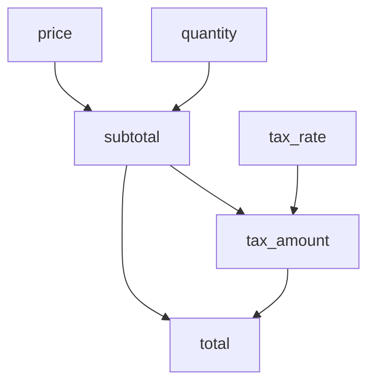

# Computed Properties

Observant provides a powerful computed properties system that allows you to define properties that depend on other fields and automatically update when those fields change. This page explains how computed properties work in Observant.

## Overview

Computed properties are virtual fields that derive their values from other fields. They are useful for:

- Combining multiple fields (e.g., full name from first and last name)
- Formatting data (e.g., formatted date from a timestamp)
- Calculating derived values (e.g., total price from quantity and unit price)
- Implementing complex business logic

Key features of computed properties in Observant:

- Automatic dependency tracking
- Observable access to computed values
- Support for validation
- Integration with the undo system

> **Important**: Computed properties are read-only. You cannot directly set their values, as they are derived from their dependencies. To change a computed property's value, you must modify its dependencies.

## Registering Computed Fields

You can register a computed property using the `register_computed` method of `ObservableProxy`. This method takes:

- The name of the computed property
- A function that calculates the value
- A list of field names that the computed property depends on

```python
from dataclasses import dataclass
from observant import ObservableProxy

@dataclass
class User:
    first_name: str
    last_name: str

# Create a user and proxy
user = User(first_name="Alice", last_name="Smith")
proxy = ObservableProxy(user)

# Register a computed property for full name
proxy.register_computed(
    "full_name",
    lambda: f"{proxy.observable(str, 'first_name').get()} {proxy.observable(str, 'last_name').get()}",
    dependencies=["first_name", "last_name"]
)

# Access the computed value
full_name = proxy.computed(str, "full_name").get()
print(full_name)  # "Alice Smith"
```

### Accessing Computed Values

You can access a computed value using the `computed` method, which returns an observable:

```python
# Get the computed value as an observable
full_name_obs = proxy.computed(str, "full_name")

# Register a callback to be notified when the computed value changes
full_name_obs.on_change(lambda value: print(f"Full name changed to: {value}"))

# Get the current value
current_full_name = full_name_obs.get()
```

### Updating Dependencies

When a dependency of a computed property changes, the computed property is automatically recalculated:

```python
# Change a dependency
proxy.observable(str, "first_name").set("Bob")

# The computed property is automatically updated
print(proxy.computed(str, "full_name").get())  # "Bob Smith"
```

## Dependency Tracking

Observant tracks dependencies between computed properties and their source fields. When a source field changes, all computed properties that depend on it are automatically recalculated.

```python
from dataclasses import dataclass
from observant import ObservableProxy

@dataclass
class Product:
    name: str
    price: float
    quantity: int

# Create a product and proxy
product = Product(name="Widget", price=10.0, quantity=2)
proxy = ObservableProxy(product)

# Register a computed property for total price
proxy.register_computed(
    "total_price",
    lambda: proxy.observable(float, "price").get() * proxy.observable(int, "quantity").get(),
    dependencies=["price", "quantity"]
)

# Access the computed value
print(proxy.computed(float, "total_price").get())  # 20.0

# Update a dependency
proxy.observable(int, "quantity").set(3)

# The computed property is automatically updated
print(proxy.computed(float, "total_price").get())  # 30.0
```

### Explicit vs. Implicit Dependencies

In the examples above, we explicitly listed the dependencies of each computed property. Observant also supports implicit dependency detection, where the dependencies are inferred from the fields accessed in the computation function.

However, it's generally recommended to explicitly list dependencies for clarity and to avoid potential issues with complex computations.

## Chained Computed Fields

Computed properties can depend on other computed properties, creating a chain of dependencies:

```python
from dataclasses import dataclass
from observant import ObservableProxy

@dataclass
class Order:
    price: float
    quantity: int
    tax_rate: float

# Create an order and proxy
order = Order(price=10.0, quantity=2, tax_rate=0.1)
proxy = ObservableProxy(order)

# Register a computed property for subtotal
proxy.register_computed(
    "subtotal",
    lambda: proxy.observable(float, "price").get() * proxy.observable(int, "quantity").get(),
    dependencies=["price", "quantity"]
)

# Register a computed property for tax amount, which depends on subtotal
proxy.register_computed(
    "tax_amount",
    lambda: proxy.computed(float, "subtotal").get() * proxy.observable(float, "tax_rate").get(),
    dependencies=["subtotal", "tax_rate"]
)

# Register a computed property for total, which depends on subtotal and tax amount
proxy.register_computed(
    "total",
    lambda: proxy.computed(float, "subtotal").get() + proxy.computed(float, "tax_amount").get(),
    dependencies=["subtotal", "tax_amount"]
)

# Access the computed values
print(proxy.computed(float, "subtotal").get())    # 20.0
print(proxy.computed(float, "tax_amount").get())  # 2.0
print(proxy.computed(float, "total").get())       # 22.0

# Update a dependency
proxy.observable(int, "quantity").set(3)

# All computed properties are automatically updated
print(proxy.computed(float, "subtotal").get())    # 30.0
print(proxy.computed(float, "tax_amount").get())  # 3.0
print(proxy.computed(float, "total").get())       # 33.0
```

In this example, changing the `quantity` field triggers updates to `subtotal`, which in turn triggers updates to `tax_amount` and `total`.

### Dependency Graph

The dependencies in the example above form a directed acyclic graph (DAG):



This visualization helps understand how changes propagate through the system:

1. When `price` or `quantity` changes, `subtotal` is recalculated
2. When `subtotal` or `tax_rate` changes, `tax_amount` is recalculated
3. When `subtotal` or `tax_amount` changes, `total` is recalculated

So a change to `quantity` triggers a cascade of updates through the entire graph.

## Shadowing Real Fields

Computed properties can shadow real fields, meaning they can have the same name as a field in the underlying model. This can be useful for adding formatting or validation to existing fields.

```python
from dataclasses import dataclass
from observant import ObservableProxy

@dataclass
class User:
    name: str
    age: int

# Create a user and proxy
user = User(name="alice", age=30)
proxy = ObservableProxy(user)

# Register a computed property that shadows the 'name' field
proxy.register_computed(
    "name",
    lambda: proxy.observable(str, "name").get().capitalize(),
    dependencies=["name"]
)

# Access the computed value
print(proxy.computed(str, "name").get())  # "Alice"

# The original field is still accessible
print(proxy.observable(str, "name").get())  # "alice"
```

When shadowing a field, you need to be careful to avoid infinite recursion. In the example above, the computed property accesses the original field using `proxy.observable(str, "name")`, not `proxy.computed(str, "name")`.

## Circular Dependencies

Observant detects circular dependencies between computed properties and raises an error if it finds any:

```python
from dataclasses import dataclass
from observant import ObservableProxy

@dataclass
class Circular:
    value: int

# Create a model and proxy
circular = Circular(value=0)
proxy = ObservableProxy(circular)

# Register computed properties with a circular dependency
proxy.register_computed(
    "a",
    lambda: proxy.computed(int, "b").get() + 1,
    dependencies=["b"]
)

# This will raise an error because it creates a circular dependency
proxy.register_computed(
    "b",
    lambda: proxy.computed(int, "a").get() + 1,
    dependencies=["a"]
)
```

To avoid circular dependencies, make sure that your computed properties form a directed acyclic graph (DAG), where each property only depends on properties that don't depend on it, directly or indirectly.

## Validation of Computed Fields

Computed properties can be validated just like regular fields:

```python
from dataclasses import dataclass
from observant import ObservableProxy

@dataclass
class User:
    first_name: str
    last_name: str

# Create a user and proxy
user = User(first_name="", last_name="")
proxy = ObservableProxy(user)

# Register a computed property for full name
proxy.register_computed(
    "full_name",
    lambda: f"{proxy.observable(str, 'first_name').get()} {proxy.observable(str, 'last_name').get()}",
    dependencies=["first_name", "last_name"]
)

# Add a validator to the computed field
proxy.add_validator("full_name", lambda v: "Full name too short" if len(v.strip()) < 5 else None)

# Check validation
print(proxy.is_valid())  # False
print(proxy.validation_for("full_name").get())  # ["Full name too short"]

# Update the dependencies
proxy.observable(str, "first_name").set("Alice")
proxy.observable(str, "last_name").set("Smith")

# Validation is automatically updated
print(proxy.is_valid())  # True
print(proxy.validation_for("full_name").get())  # []
```

When a dependency of a computed property changes, the computed property is recalculated and its validators are re-run.

## Computed Fields and Undo

Computed properties are not directly undoable, since their values are derived from other fields. However, when you undo changes to a field that a computed property depends on, the computed property will update accordingly:

```python
from dataclasses import dataclass
from observant import ObservableProxy

@dataclass
class User:
    first_name: str
    last_name: str

# Create a user and proxy
user = User(first_name="Alice", last_name="Smith")
proxy = ObservableProxy(user, undo=True)

# Register a computed property for full name
proxy.register_computed(
    "full_name",
    lambda: f"{proxy.observable(str, 'first_name').get()} {proxy.observable(str, 'last_name').get()}",
    dependencies=["first_name", "last_name"]
)

# Make a change
proxy.observable(str, "first_name").set("Bob")
print(proxy.computed(str, "full_name").get())  # "Bob Smith"

# Undo the change
proxy.undo("first_name")
print(proxy.computed(str, "full_name").get())  # "Alice Smith"
```

## Next Steps

Now that you understand how computed properties work in Observant, you might want to explore:

- [Dirty Tracking](dirty.md): Track unsaved changes
- [Sync vs Non-Sync](sync.md): Understand immediate vs. deferred updates
- [Saving and Loading](save_load.md): Save changes and load data

[← Back to Overview](../index.md)
